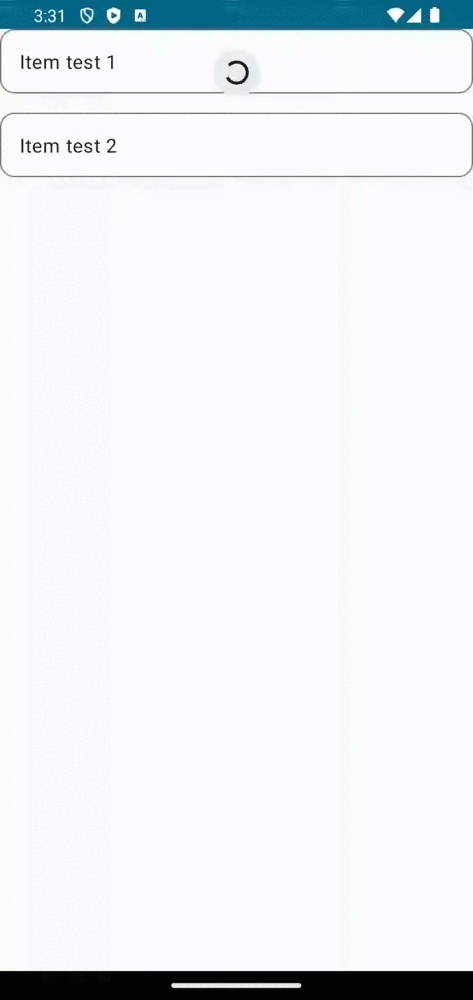

# Material3PullToRefresh

[](https://github.com/BambooAppsDevTeam/Material3PullToRefresh/actions/workflows/lint.yml)
[](https://central.sonatype.com/artifact/eu.bambooapps/compose-material3-pullrefresh/)

This is a library for Jetpack Compose to add pull-to-refresh capability to the composables. Adapted from the `compose-material` library and adjusted for the Material 3. This way, you won't need to add `compose-material` dependency if you already use Material 3 only.

The pull refresh indicator uses tonal elevation instead of shadow.



## Usage

We recommend using version catalog to define the dependency:

```toml
[versions]
# ...
pullRefresh = "1.0.0"

[libraries]
pullrefresh = { module = "eu.bambooapps:compose-material3-pullrefresh", version.ref = "pullRefresh" }
```

And in your app's `build.gradle.kts`:

```kotlin
dependencies {
    // ...
    implementation(libs.pullrefresh)
}
```

Alternatively, you can define the dependency directly:

```kotlin
dependencies {
    // ...
    implementation("eu.bambooapps:compose-material3-pullrefresh:1.0.0")
}
```

First, you will need to initialize state for pull-to-refresh:

```kotlin
val isRefreshing by remember {
    mutableStateOf(false)
}

val state = rememberPullRefreshState(refreshing = isRefreshing, onRefresh = {})
```

Then, you'll need to add a modifier to your composable, e.g. `LazyColumn`:

```kotlin
LazyColumn(
    modifier = Modifier.pullRefresh(state)
) {
// ...
}
```

After that, you'll need to add an indicator somewhere near the composable you've applied `pullRefresh` Modifier to. We recommend to wrap it into the `Box` together with the indicator, so you can neatly position your indicator:

```kotlin
PullRefreshIndicator(
    refreshing = isRefreshing, 
    state = state,
    modifier = Modifier
        .align(Alignment.TopCenter)
)
```

Here's a full example:

```kotlin
@OptIn(ExperimentalMaterial3Api::class)
@Composable
fun PullToRefresh(modifier: Modifier = Modifier) {
    Box(modifier = modifier) {
        val isRefreshing by remember {
            mutableStateOf(false)
        }
        val state = rememberPullRefreshState(refreshing = isRefreshing, onRefresh = {})
        
        LazyColumn(
            modifier = Modifier.pullRefresh(state),
            verticalArrangement = Arrangement.spacedBy(16.dp)
        ) {
            items(listOf("test 1", "test 2")) {
                OutlinedCard(modifier = Modifier.fillMaxWidth()) {
                    Text(text = "Item $it", modifier = Modifier.padding(16.dp))
                }
            }
        }
        PullRefreshIndicator(refreshing = isRefreshing, state = state,
            modifier = Modifier
                .align(Alignment.TopCenter)
        )
    }
}

```
